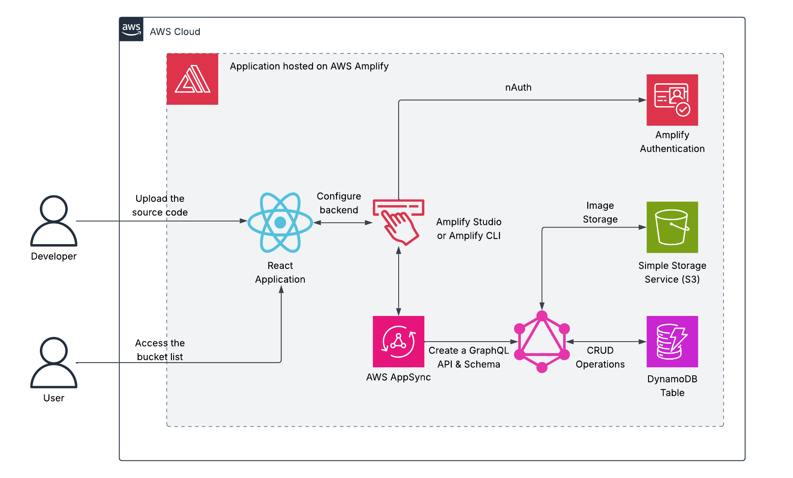

# AWS Bucket List Tracker  
A full-stack **serverless** web application that allows users to create, update, and manage their personal bucket lists. The frontend is built with **React** and hosted on **AWS Amplify**, while the backend leverages **Amplify Authentication** for secure login/signup, **AWS AppSync** for GraphQL API management, and **Amazon DynamoDB** for data storage. This project demonstrates how to integrate **Amplify’s CI/CD pipeline** with **GitHub** so that changes pushed to the repository automatically update the deployed application. It showcases best practices for building modern cloud-native applications that include authentication, data APIs, and persistent storage, all without the need to manage servers.  

## Architecture Overview
  
*Figure 1: Architecture diagram of the Bucket List Tracker application hosted on AWS Amplify.*
- **Amazon S3** – Underlying storage for hosting the React frontend via Amplify.
- **Amplify Hosting** - Hosts the React frontend and automatically redeploys on GitHub commits.
- **Amplify Authentication** - Provides secure user login/signup functionality.
- **AWS AppSync** - Manages GraphQL API to interact with backend data.
- **Amazon DynamoDB** - NoSQL database for storing and retrieving bucket list items.
 
## Skills Applied
- Building and hosting a React application on AWS Amplify.
- Configuring Amplify Authentication for user login/signup flows.
- Creating and managing a GraphQL API with AWS AppSync.
- Integrating DynamoDB with a GraphQL schema to perform CRUD operations.
- Working with GitHub CI/CD to automatically update application deployments.

## Features
- **User Authentication** – Sign up, log in, and manage personal bucket list securely.
- **Real-time GraphQL API** – AppSync powers fast data queries and updates.
- **Persistent Data Storage** – DynamoDB ensures all bucket list items are stored reliably.
- **CI/CD Workflow** – Automatic deployment from GitHub commits to Amplify Hosting.  

## Tech Stack
- **Languages:** JavaScript (React 19.1), Node.js 22.18
- **AWS Services:** Amplify Hosting, Amplify Auth, AppSync, DynamoDB
- **IaC Tool:** *(Amplify auto-generated configuration - no additional SAM/Terraform used)* 
- **Other Tools:** GitHub, Amplify CLI/Studio 

## Deployment Instructions
> **Note:** All command-line examples use `bash` syntax highlighting to maximize compatibility and readability. 

> If you are using PowerShell or Command Prompt on Windows, the commands remain the same but prompt styles may differ.

1. Clone this repository.
   
2. Navigate to the `bucketlistapp/` folder and install dependencies:
   ```bash
   cd bucketlistapp
   npm install
   ```
   
3. Install the Amplify packages and libraries:
   ```bash
   npm create amplify@latest -y
   npm install aws-amplify @aws-amplify/ui-react
   ```
  
4. Create a new repository in GitHub and push the code using Git:
   ```bash
   git init
   git add .
   git commit -m "initial commit"
   git remote add origin git@github.com:<your-username>/bucketlistapp.git
   git branch -M main
   git push -u origin main
   ```
   
5. Deploy your Application to Amplify
	- In the AWS Management Console, go to the Amplify console and click **Deploy an app**.
	- Select GitHub for **Deploy your app** and authenticate when prompted. Select the newly created GitHub repository and branch.
	- Click **Create and use a new service role**
	- Click **Save and deploy**.

6. *(Optional)* Deploy Amplify backend in a cloud sandbox for rapid testing:
	```bash
	npx ampx sandbox
	```
	- This will generate the `bucketlistapp/amplify_outputs.json` file.
	- Sandboxes can be managed in the Amplify console under **Manage sandboxes**.

7. *(Optional)* Launch the application locally to test:
	```bash
	npm run dev
	```
	- Copy the localhost link that appears in the terminal and paste it into a web browser.

8. In the Amplify console, click **Visit deployed URL** to access the application.

9. *(Optional)* Edit the files in the `bucketlistapp` directory and push them using Git. Amplify will automatically update the hosted deployment.

**Note:** Node.js 22.x or later with npm is required to deploy the application. Ensure the AWS CLI is configured (`aws configure`) with credentials that have sufficient permissions to create resources on **AWS Amplify**.

## How to Use
1. **Deploy the infrastructure** using AWS Amplify.

2. **Select the Create Account Tab** and enter values in the **Username**, **Password**, and **Confirm password** fields. Click **Create Account**.

3. **Enter the verification code** provided via email. Click **Confirm** to login.

4. **Enter a Bucket List Item and Description**. Click **Choose File** and select an image to upload. Click **Add to Bucket List** to upload the image.

5. **Images will appear under My Bucket List Items**. Click **Delete Item** to delete an image.

6. **Sign out of the application** using the **Sign Out** button.

## Project Structure
```plaintext
aws-bucket-list-tracker/
├── assets/                         # Images, diagrams, screenshots
│   ├── architecture-diagram.png    # Project architecture
│   └── application-screenshot.png  # UI screenshot
├── bucketlistapp/                  # React app with Amplify configuration
│   ├── src/                        # Application source code
│   ├── amplify/                    # Amplify backend configs
│   └── package.json                # Project dependencies
├── LICENSE
├── README.md
└── .gitignore
```

## Screenshot


*Figure 2: Bucket List Tracker Application UI.*  

## Future Enhancements
- **Enhanced UI/UX** with a more polished design and accessibility features.
- **Bucket List Sharing** to allow users to share their lists with friends or on social media.
- **Notifications/Reminders** using Amazon SNS or Pinpoint to remind users of upcoming goals.
- **Offline Support** with Amplify DataStore for local storage and automatic sync when online.
- **Multi-Region Deployment** to improve performance and reliability across global users.

## License
This project is licensed under the [MIT License](LICENSE).

---

## Author
**Patrick Heese**  
Cloud Administrator | Aspiring Cloud Engineer/Architect  
[LinkedIn Profile](https://www.linkedin.com/in/patrick-heese/) | [GitHub Profile](https://github.com/patrick-heese)

## Acknowledgments
This project was inspired by a course from [techwithlucy](https://github.com/techwithlucy).  
The bucketlistapp configuration is taken directly from the author's original implementation.  
The architecture diagram included here is my own version, adapted from the original course diagram.  
I designed and developed all project documentation. Amplify automatically generated the backend configuration for this application.  
